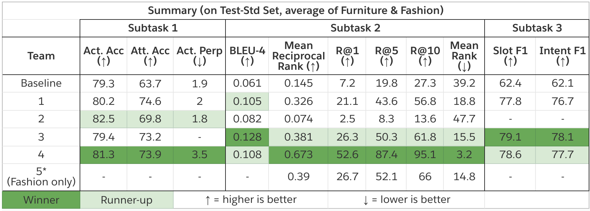

## SIMMC Track Results (DSTC9), 2020

### TL;DR
The first edition of the Situated and Interactive Multimodal Conversations (SIMMC) Track at the Dialog State Tracking Challenge (DSTC) 9 came to a successful end!
The challenge saw a total of **11** model entries from **5** teams across the world, setting a new state-of-the-art in all three subtasks:

1. **Subtask 1 (Assistant API Prediction)**
    * Action accuracy increased by 3 points (79.3% to 82.5%)
    * Action Attribute accuracy increased by ~10 points (63.7% to 73.9%)
2. **Subtask 2 (Assistant Response Generation)**
	* BLEU score increased by 0.067 points (0.061 to 0.128)
	* Recall@1 increased by 45 points (7.2% to 52.6%)
3. **Subtask 3 (Dialog State Tracking)**
	* Slot F-1 increased by 16.7 points (62.4% to 79.1%)
	* Intent F-1 increased by 16 points (62.1% to 78.1%)

Congratulations to the winners and runners-up, and a big thanks to all the participants!

### Details
We launched the SIMMC challenge in June, 2020. Please checkout the 
[main page](#1), [paper](#2), and the [Facebook AI blog](#2) for more details. 

Please checkout the challenge page, paper, and the Facebook AI blog for further details about the challenge, dataset, tasks, and the evaluation metrics.
 
**Results Summary**

<figure>

<figcaption><i>Summary on Test-Std split, average of Furniture and Fashion.</i></figcaption>
</figure>

| Team | Affiliation                                       | Github |
|:----:|-----------------------------------------------------|:----:|
|  1   | National Taiwan University, Taiwan                  | [Link](4) |
|  2   | Sogang University, South Korea                      | [Link](5) |
|  3   | Sogang University, South Korea                      | [Link](6) |
|  4   | Institute for Infocomm Research, A-STAR, Singapore  | [Link](7) |
|  5   | LINKS Foundation and Politecnico di Torino, Italy   | [Link](8) |

**Detailed Results** 

<iframe src="https://docs.google.com/spreadsheets/d/e/2PACX-1vRPfjuesfrMrDoDZ34uNB8zDH2XutHc_ScXvao4PzUaCPXPM_uIu5hkJ2FSoByepgdEyk35Ti8lHha-/pubhtml?gid=1354274332&amp;single=true&amp;widget=true&amp;headers=false" width=600px></iframe>

[1]: https://github.com/facebookresearch/simmc
[2]: https://arxiv.org/abs/2006.01460
[3]: https://ai.facebook.com/blog/simmc-a-data-set-for-developing-next-generation-shopping-assistants/
[4]: https://github.com/billkunghappy/DSTC_TRACK4_ENTER
[5]: https://github.com/inkoon/simmc
[6]: https://github.com/boychaboy/simmc
[7]: https://github.com/i2r-simmc/i2r-simmc-2020
[8]: https://github.com/D2KLab/dstc9-SIMMC