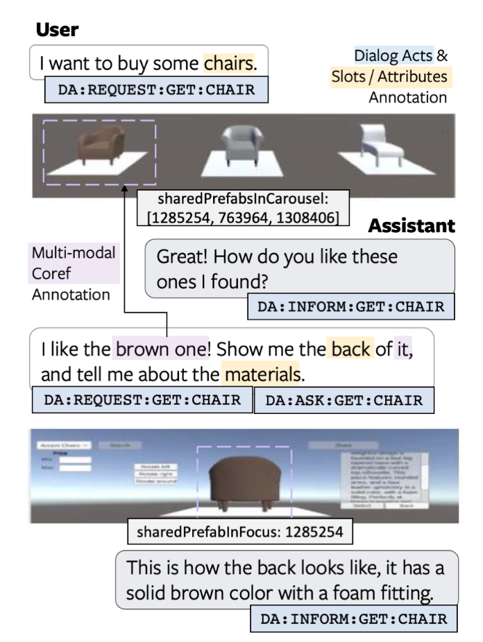

# Situated Interactive MultiModal Conversations (SIMMC) Challenge 2020

Welcome to the Situated Interactive Multimodal Conversations (SIMMC) Track for [DSTC9][dstc9] 2020.

The SIMMC challenge aims to lay the foundations for the real-world assistant agents that can handle multimodal inputs, and perform multimodal actions.
We thus focus on **task-oriented** dialogs that encompass a **situated** multimodal user context in the form of a co-observed image or virtual reality (VR) environment.
The context is **dynamically** updated on each turn based on the user input and the assistant action.
Our challenge focuses on our SIMMC datasets, both of which are shopping domains:
(a) furniture (grounded in a shared virtual environment) and, 
(b) fashion (grounded in an evolving set of images).   

**Organizers**: Ahmad Beirami, Eunjoon Cho, Paul A. Crook, Ankita De, Alborz Geramifard, Satwik Kottur, Seungwhan Moon, Shivani Poddar, Rajen Subba

<figure>
 
<figcaption><i>Example from SIMMC-Furniture Dataset</i></figcaption> 
</figure>


### Latest News

* **[June 22, 2020]** Challenge announcement. Training / development datasets are released.
* **[July 8, 2020]** Evaluation scripts and code to train baselines for 
Sub-Task #1, Sub-Task #2 released.

## Important Links

* [Task Description Paper][simmc_arxiv]
* [Challenge Registration](https://forms.gle/jdT79eBeySHVoa1QA)
* [Data Formats](data/README.md)
* **Baseline Details**: [MM Action Prediction](mm_action_prediction/README.md), [MM Response Generation](mm_response_generation/README.md), [MM-DST](mm_dst/README.md)
* [Challenge Instructions](#challenge-instructions)
* [Submission Instructions](#submission-instructions-&-timeline)


## Timeline

| **Date** | **Milestone** |
| :--: | :-- |
| June 22, 2020 | Training & development data released |
| Sept 28, 2020  | Test-Std data released, End of Challenge Phase 1 |
| Oct 5, 2020 | Entry submission deadline, End of Challenge Phase 2 |
| Oct 12, 2020  | Final results announced |


## Track Description

### Tasks and Metrics

We present three sub-tasks primarily aimed at replicating human-assistant actions in order to enable rich and interactive shopping scenarios.

| Sub-Task #1 | [Multimodal Action Prediction](mm_action_prediction) |
|---------|---------------------------------------------------------------------------------------------------------------------------------------|
| Goal | To predict the correct Assistant API action(s) (classification) |
| Input | Current user utterance, Dialog context, Multimodal context |
| Output |  Structural API (action & arguments) |
| Metrics |  Perplexity, Mean Average Precision |

| Sub-Task #2 | [Multimodal Dialog Response Generation & Retrieval](mm_response_generation)  |
|---------|---------------------------------------------------------------------------------------------------------------------------------------|
| Goal | To generate Assistant responses or retrieve from a candidate pool  |
| Input | Current user utterance, Dialog context, Multimodal context, (Ground-truth API Calls) |
| Output | Assistant response utterance |
| Metrics | Generation: BLEU-4, Retrieval: Accuracy@k, Entropy |

| Sub-Task #3 | [Multimodal Dialog State Tracking (MM-DST)](mm_dst) |
|---------|---------------------------------------------------------------------------------------------------------------------------------------|
| Goal | To track user belief states across multiple turns |
| Input | Current user utterance, Dialogue context, Multimodal context |
| Output | Belief state for current user utterance |
| Metrics | Intent F1, Slot F1 |

Please check the [task input](./TASK_INPUTS.md) file for a full description of inputs
for each subtask.

### Evaluation

For the DSTC9 SIMMC Track, we will do a two phase evaluation as follows. 

**Challenge Period 1**:
Participants will evaluate the model performance on the provided `devtest` set.
At the end of Challenge Period 1 (Sept 28), we ask participants to submit their model prediction results and a link to their code repository.

**Challenge Period 2**:
A `test-std` set will be released on Sept 28 for the participants who submitted the results for the Challenge Period 1.
We ask participants to submit their model predictions on the `test-std` set by Oct 5. 
We will announce the final results and the winners on Oct 12.


## Challenge Instructions

### (1) Challenge Registration

* Fill out [this form](https://forms.gle/jdT79eBeySHVoa1QA) to register at DSTC9. Check “**Track 4: Visually Grounded Dialog Track**” along with other tracks you are participating in.

### (2) Download Datasets and Code

* Irrespective of participation in the challenge, we'd like to encourge those interested in this dataset to complete this [optional survey](https://oculus.qualtrics.com/jfe/form/SV_1AlazoSV7iwepZH). This will also help us communicate any future updates on the codebase, the datasets, and the challenge track.

* Git clone our repository to download the datasets and the code. You may use the provided baselines as a starting point to develop your models.
```
$ git lfs install
$ git clone https://github.com/facebookresearch/simmc.git
```

### (3) Reporting Results for Challenge Phase 1
* Submit your model prediction results on the `devtest` set at simmc@fb.com (more instructions to follow later). 
* We will then send you the `test-std` set (with ground-truth labels hidden) on Sept 28.

### (4) Reporting Results for Challenge Phase 2
* Submit your model prediction results on the `test-std` set at simmc@fb.com (more instructions to follow later). 
* We will evaluate the participants’ model predictions using the same evaluation script for Phase 1, and announce the results.

## Submission Instructions & Timeline

<table>
  <tbody>
    <tr>
      <td rowspan=4><ins>Before</ins> Sept 28th 2020</td>
      <td rowspan=4>Each Team</td>
      <td>Each participating team should create a repository, e.g. in github, that can be made public under a permissive open source license (MIT License preferred). Repository doesn’t need to be publicly viewable yet.</td>
    </tr>
    <tr>
      <td>Ahead of test data release tag a repository commit that contains both runable code and model parameter files that are the team’s entries for all sub-tasks attempted.</td>
    </tr>
    <tr>
      <td>Tag commit with “dstc9-simmc-entry”.</td>
    </tr>
    <tr>
      <td>Models (model parameter files) and code should have associated date-time stamps which are before Sept 27 23:59:59 anywhere on Earth.</td>
    </tr>
    <tr>
      <td>Sept 28th 2020</td>
      <td>SIMMC Organizers</td>
      <td>Test-Std data released (during US Pacific coast working hours).</td>
    </tr>
    <tr>
      <td rowspan=5><ins>Before</ins> Oct 5th 2020</td>
      <td rowspan=5>Each Team</td>
      <td>Generate test data predictions using the code & model versions tagged previously with &quot;dstc9-simmc-entry&quot;.</td>
    </tr>
    <tr>
      <td>For each sub-task that the team attempted, create a PR and check-in to the team’s repository.</td>
    </tr>
    <tr>
      <td> The PR/check-in should contain an output directory with the model output in JSON format that can be scored with the automatic scripts provided for that sub-task.</td>
    </tr>
    <tr>
      <td>In the PR comments paste the results of running the automatic test scripts.</td>
    </tr>
    <tr>
      <td>Tag the commit with &quot;dstc9-simmc-test-subtask-&lt;N&gt;&quot;, where &lt;N&gt; is the sub-task number.</td>
        </tr>
    <tr>    
      <td rowspan=2>By Oct 5th 2020</td>
      <td rowspan=2>Each Team</td>
      <td>Make the team repository public under a permissive Open Source license (MIT license is prefered).</td>
    </tr>
    <tr>
      <td>Email the SIMMC Organizers a link to the repository at simmc@fb.com</td>
    </tr>
    <tr>
      <td>Oct 5th - Oct 12th 2020</td>
      <td>SIMMC Organizers</td>
      <td>SIMMC organizers to validate sub-task results.</td>
    </tr>
    <tr>
      <td>Oct 12th 2020</td>
      <td>SIMMC Organizers</td>
      <td>Publish anonymized team rankings on the SIMMC track github and email each team their anonymized team identity.</td>
    </tr>
    <tr>
      <td>Post Oct 12th 2020</td>
      <td>SIMMC Organizers</td>
      <td>Our plan is to write up a challenge summary paper. In this we may conduct error analysis of the results and may look to extend, e.g. possibly with human scoring, the submitted results.</td>
    </tr>
  </tbody>
</table>


## Contact

### Questions related to SIMMC Track, Data, and Baselines
Please contact simmc@fb.com, or leave comments in the Github repository.

### DSTC Mailing List
If you want to get the latest updates about DSTC9, join the [DSTC mailing list](https://groups.google.com/a/dstc.community/forum/#!forum/list/join).


## Citations

If you want to publish experimental results with our datasets or use the baseline models, please cite the following articles:
```
@article{moon2020situated,
  title={Situated and Interactive Multimodal Conversations},
  author={Moon, Seungwhan and Kottur, Satwik and Crook, Paul A and De, Ankita and Poddar, Shivani and Levin, Theodore and Whitney, David and Difranco, Daniel and Beirami, Ahmad and Cho, Eunjoon and Subba, Rajen and Geramifard, Alborz},
  journal={arXiv preprint arXiv:2006.01460},
  year={2020}
}

@article{crook2019simmc,
  title={SIMMC: Situated Interactive Multi-Modal Conversational Data Collection And Evaluation Platform},
  author={Crook, Paul A and Poddar, Shivani and De, Ankita and Shafi, Semir and Whitney, David and Geramifard, Alborz and Subba, Rajen},
  journal={arXiv preprint arXiv:1911.02690},
  year={2019}
}
```
**NOTE**: The [paper][simmc_arxiv] above describes in detail the datasets, the NLU/NLG/Coref annotations, and some of the baselines we provide in this challenge. The paper reports the results from an earlier version of the dataset and with different train-dev-test splits, hence the baseline performances on the challenge resources will be slightly different. 

## License

SIMMC is released under [CC-BY-NC-SA-4.0](https://creativecommons.org/licenses/by-nc-sa/4.0/legalcode), see [LICENSE](LICENSE) for details.


[dstc9]:https://sites.google.com/dstc.community/dstc9/home
[simmc_arxiv]:https://arxiv.org/abs/2006.01460
